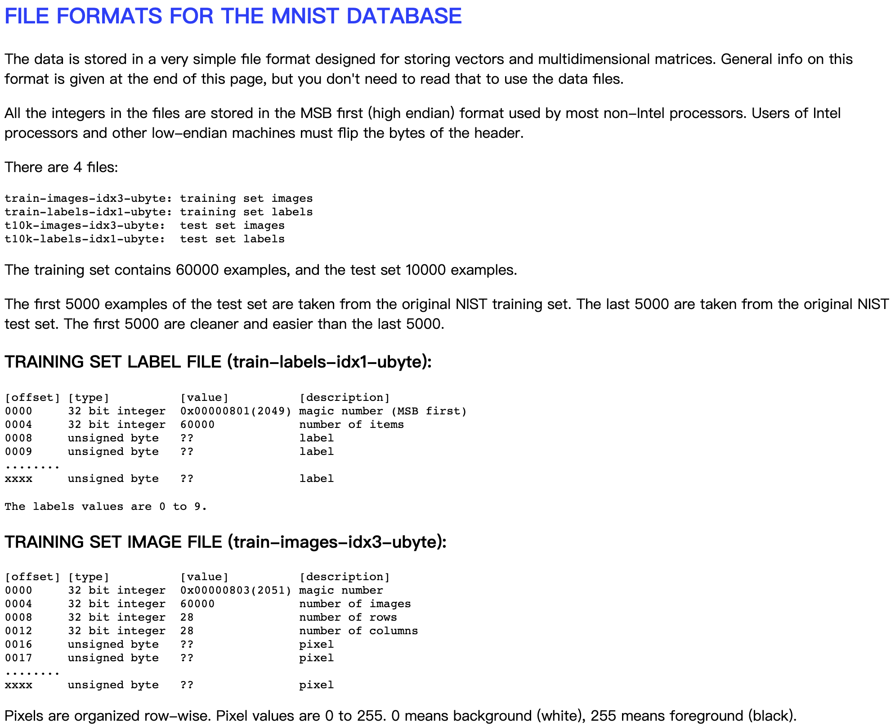

&emsp;
# MNIST数据集解析
# 1 大小端
## 1.1 概念

1、首先大小端是面向多字节类型定义的，比如2字节、4字节、8字节整型、长整型、浮点型等，单字节的字符串一般不用考虑。

2、大端小端存储、传输、以及接收处理需要对应。

3、大端（Big-Endian）就是高字节（MSB）在前，内存存储体现上，数据的高位更加靠近低地址。

4、小端 (Little-Endian) 就是低字节（LSB）在前，内存存储体现上，数据的低位更加靠近低地址。

5、网络字节序一般是指大端传输。

&emsp;
## 1.2 大小端存储示例
假设一个32位 unsigned int型数据0x12 34 56 78，大小端8位存储方式如下：

大端存储方式为
```
0x12 34 56 78
```
小端存储方式为
```
0x78 56 34 12
```

&emsp;
# 2 struct 介绍

## 2.1 Byte Order, Size, and Alignment
By default, C types are represented in the machine’s native format and byte order, and properly aligned by skipping pad bytes if necessary (according to the rules used by the C compiler).

Alternatively, the first character of the format string can be used to indicate the byte order, size and alignment of the packed data, according to the following table:

Character | Byte order | Size | Alignment
:--|:--|:--|:--
@ | native | native | native
= | native | standard | none
< | little-endian | standard | none
\> | big-endian | standard | none
! | network (= big-endian) | standard | none


&emsp;
## 2.2 Format Characters
Format characters have the following meaning; the conversion between C and Python values should be obvious given their types. The ‘Standard size’ column refers to the size of the packed value in bytes when using standard size; that is, when the format string starts with one of '<', '>', '!' or '='. When using native size, the size of the packed value is platform-dependent.

Format | C Type | Python type | Standard size
:--|:--|:--|:--
x | pad byte | no value
c | char | bytes of length 1 | 1
b | signed char | integer | 1
B | unsigned char | integer | 1
? | _Bool | bool |1
h | short | integer |2
H | unsigned short | integer | 2
i | int | integer | 4
I | unsigned int | integer | 4
l | long | integer | 4
L | unsigned long | integer | 4
q | long long | integer | 8
Q | unsigned long long | integer | 8
n | ssize_t | integer
N | size_t | integer
e | | float | 2
f | float |float | 4
d | double | float | 8
s | char[] | bytes
p | char[] | bytes
P | void * | integer

## 2.3 unpack_from(format, buffer, offset=0)
Identical to the unpack_from() function, using the compiled format. The buffer’s size in bytes, starting at position offset, must be at least size.
- format: 格式
- buffer: 数据
- offset: 字节偏移量

&emsp;
# 3 MNIST 数据集



